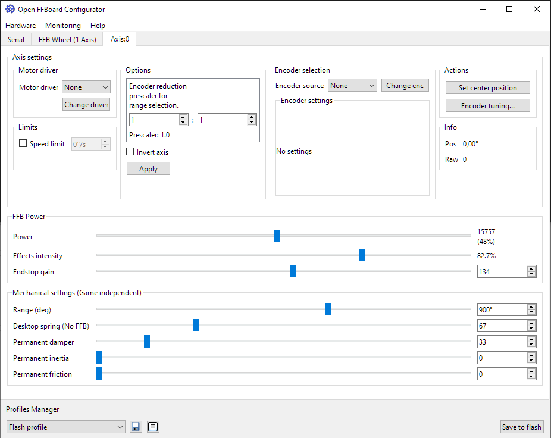

## Configurator GUI

### Prerequisites
Download latest configuration GUI from GitHub as a standalone Windows pyinstaller build: https://github.com/Ultrawipf/OpenFFBoard-configurator/releases 
Most options are automatically detected, and menus populated from data read from the firmware. 

Optionally the GUI (`main.py`) can be executed directly from the repo if python and its requirements are installed.

#### Language selector
Default language is English, and all settings read from the firmware are reported in English.  However internal GUI text elements can be translated. Available languages are listed in the language selector and submitted by community members.

### Connection page
On this page the serial port must be selected (may automatically select and connect).
Compatible devices matching the right VID/PID are highlighted green.

On the lower edge of the window the mainclass can be changed. This defines the operation mode of the device. Usually “FFB Wheel” is the desired mode for a Wheelbase but debug interface modes and 2 axis operation may be available in certain firmware builds. “Basic” failsafe mode only opens the serial port to change the mode in case of a failure when the system button is held during startup.
Some debug modes may be hidden until the debug mode toggle is activated.

#### FFB wheel configuration

#### Update rate 

The update rate is the rate at which the gamepad data is sent to the PC. Should be at 1000Hz. Lowering may help with overloaded USB buses.
May also change the internal effect update rate in a future release for slow motor drivers.

#### Button sources and analog axes

- Button sources are different sources of binary inputs sent as gamepad buttons. 
- Analog axes are sources of analog inputs sent as gamepad axes.

See [pinouts and peripherals](https://github.com/Ultrawipf/OpenFFBoard/wiki/Pinouts-and-peripherals) for details of some sources.

#### Constant force filter

The constant force filter is a lowpass biquad filter applying to only the constant force effect and is the preferred way of smoothing forces instead of reducing the motor drivers bandwidth which can have undesirable effects for other force components.

The constant force effect is the main effect used by most games to transfer a force to the device as it gives the game full control and contains a static force value each update packet. This can lead to noisy and spikey forces at low update rates if not filtered.

The lowpass filter allows smoothing of these forces and must be tuned depending on the game for best results and can give either a smooth or highly detailed feel depending on personal preferences.

Lowering the frequency makes forces smoother. Frequency should be usually around the games update rate (50-200hz).
Lowering the Q factor changes the filters rolloff response. 0.7 is the normal value.

#### Conditional effect settings

Conditional effects are game controlled effects calculated on the device itself.
As the game does not have full control over how the effect actually scales the intensity of these effects can be changed manually.
A higher spring gain makes the spring effect reach its maximum earlier. A gain of only 1 means it needs the whole range at maximum magnitude to reach the full force which is usually not desirable. 

For damper, friction and inertia reducing the gain may make them more stable.

#### Advanced tuning

The advanced tuning popup gives finer control with previews over these settings. Usually it does not require changes.

### Axis
Axis settings apply to a single axis directly and are therefore separate from common effect settings.

#### Motor driver
The motor driver is the force output of this axis. If the TMC4671 is used select it here. Depending on the motor driver and its settings there may be no separate encoder selection possible if the position is read from the motor driver.

#### Encoder selection
If the motor driver does not force itself as the position source a separate encoder can be selected as the position source.

#### Encoder reduction
Usually 1:1 is desired. 

If there is a gearbox or other reduction between the encoder and steering wheel this scales the range internally so that the degrees and angle dependant effects work properly.

#### Invert axis
Inverting the axis flips the gamepad output values and internal force accordingly. The result is that left and right are swapped in a steering wheel.

#### Power

This is the main setting for the output force intensity. The power scales all output forces for the motor driver. 

For the TMC it also directly controls the motor current so make sure to not set it too high and not too low. Too low may not allow the motor to calibrate. Too high may result in hardware damage or power supplies tripping the OCP.

#### Effect intensity

This is a separate scaler for controlling the ratio between all forces resulting from effects and the endstop effect. A setting of 80% leaves 20% of the output power for the endstop so it is possible to still feel it if the effects are already clipping to prevent you from going out of range.
Generally this should be used to make effects for a game temporarily weaker and with a lower ratio on strong motors to make good use of the endstop headroom.

#### Endstop gain

The endstop gain changes how stiff the virtual endstop effect feels. When set too high it may feel jerky. Tune this to taste.

#### Range

This scales the output range of the gamepad axis and requires proper CPR and prescaler settings.
The range is how far a steering wheel can move before hitting the virtual endstop. 

#### Permanent damper, inertia and friction

Damper is an always active virtual damper effect making it feel heavier. It can prevent oscillations and make the system feel more stable when increased or lighter when decreased. Inertia also makes the wheel feel heavier but may cause more overshoot. Tune this to taste.
Friction can be used to fine tune the feel as well but should usually not be required.

#### Set center position

Depending on the encoder and motor driver settings it may be required to manually set the center position of an axis. For example on a steering wheel hold it straight and press this button to properly center the wheel.
The "SW" hardware system button also has the same effect.

#### Speed limit

The speed limit tries to reduce the output torque at a certain speed. If set significantly lower than the motors top speed with a high acceleration it may be unstable. Usually a speed limit is not desired and should be turned off.

### TMC4671

#### Current graph

The graph shows the phase currents and temperature live.
The flux component is usually 0 in operation as it does not contribute to force. It is mainly used during calibration sequences.

#### PI tuning
#### Torque filter
The torque filter is an internal biquad filter running at full PWM frequency (25kHz) and has an interpolating effect. It is applied to all input torque values and therefore should not be lower than half the effect processing rate of usually 1kHz. Keep it between 500Hz and 1kHz or off for best results.

#### Motor
The TMC4671 supports 3 phase synchronous motors, 2 phase stepper motors and experimentally DC motors.

The pole pairs are usually in the motors datasheet. Sometimes as poles and sometimes pole pairs (poles/2). Common values are 3,4 and 5 pole pairs for 3 phase motors and 50 for steppers.

#### Encoder

The TMC4671 supports incremental ABN encoders, analog SinCos and analog 3 phase encoders. 
Alternatively hall sensors can be used as a low resolution position source with geared motors.

Additionally external encoders via are supported at reduced update rates.
This allows BISS-C or other absolute encoders to be forwarded via the main controller. 

The encoder must be selected on the axis tab.

##### Combine ext encoder 
For multi interface encoders it is possible to select a different encoder for the axis than for the motor driver allowing to get the best of both encoder types without forwarding.

#### PI tuning
PI tuning allows precise control over the internal current control loop.
Usually default values of around 700 P, 800 I are fine for most big servo motors but for best results manual tuning is required.

Start with low values and increase P for example from 100 on by 100 each step until the motor seems to get noisy. Thats your P limit. Then increase I until it feels snappy without being unstable. A testing tool to create effects like wheelcheck can be useful.

##### Sequential PI
Sequential and parallel pi modes are different control structures of the TMC4671. Usually sequential gives a better response. Check the TMC4671 datasheet for details.

##### SV-PWM
Space vector PWM improves the speed of 3 phase motors. If the motor has no isolated star point turn this off. Check the TMC4671 datasheet for details.

##### PI autotune
With some motors autotuning the PI values can lead to good results or a reasonable starting point for manual tuning. Don't trust it too much. It may result in a bad tune.

#### Other settings
##### Hardware revision selector
Select the correct type of your board hardware specifically for the current sensor range. This is required to correctly scale measured currents and sets some important constants internally.

##### Full calibration
Some settings are only required to be calibrated once and can be stored in flash like the ADC offsets. Do a full calibration to calibrate these parameters. Required after hardware changes.

##### Prefer energy dissipation in motor
This ramps up the flux before the external brake resistor would activate if a voltage difference between internal and external input voltage is detected. This allows burning energy from external movements inside the motor instead of the brake resistor. It is still recommended to use an external resistor for safety and may impact the feel slightly.

### Monitoring options
Drop down menu "Monitoring"

#### Live forces

The live monitoring graph shows each effects contribution to the total output force and how many effects of each type are currently assigned by the game. 
The maximum force value range is – 32767 to 32767 for effects and the “power” value for the total output force (right Y axis).

#### Statistics

The effect stats window shows the maximum force generated by each effect type since the last reset or start and which effects were used. Useful for checking which effects are used by a game after a session.
Currently still active effects are highlighted. Inactive ones greyed out.

## Other features

### Updates
The GUI integrates a simple release browser for checking updates on GitHub for the GUI and Firmware repositories.

### Firmware update

The integrated DFU updater allows uploading a new firmware.
Check the wiki page for details: [Firmware update procedure](https://github.com/Ultrawipf/OpenFFBoard/wiki/Setup)
Requires WINUSB driver. The board can be put into DFU mode when the serial port is connected in this popup or it can be put into DFU manually before by connecting the BOOT0 pin to 3.3V and resetting. (may be a jumper on the board)

STM32CubeProgrammer can be used for updating a firmware as well and comes with the right driver installer.

### Task list
The task list popup lists all currently running rtos threads. Can be useful for debugging.

### Active features 
The active features popup shows all currently activated functions with enabled commands. Can be things like ports, encoders, motor drivers and internal modules.

### Debug mode
Enabling debug mode gives access to some otherwise blocked commands like raw TMC register access and hidden debug mainclasses.

