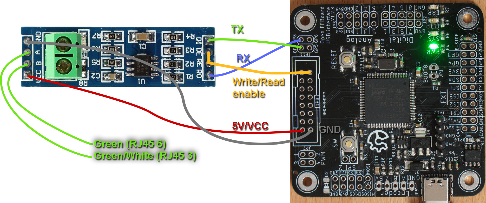

### Simplemotion setup

(TODO driver setup coming soon)

Check the [wiki pages for ionicube](https://granitedevices.com/wiki/IONICUBE_1X_connectors_and_pinouts) for pinouts.

It must be set up in Granity in torque mode and with STO and hardware enable pins set accordingly.

### Connections
Connect the following pins of the official OpenFFBoard to a RS485 transceiver (MAX585 breakout board for example)
|FFBoard pin|MAX485 pin|
|--|--|
|GP7 (TX)| DI|
|GP8 (RX)| RO|
|DRV_GP| RE & DE|
|5V| VCC|
|GND| GND|

