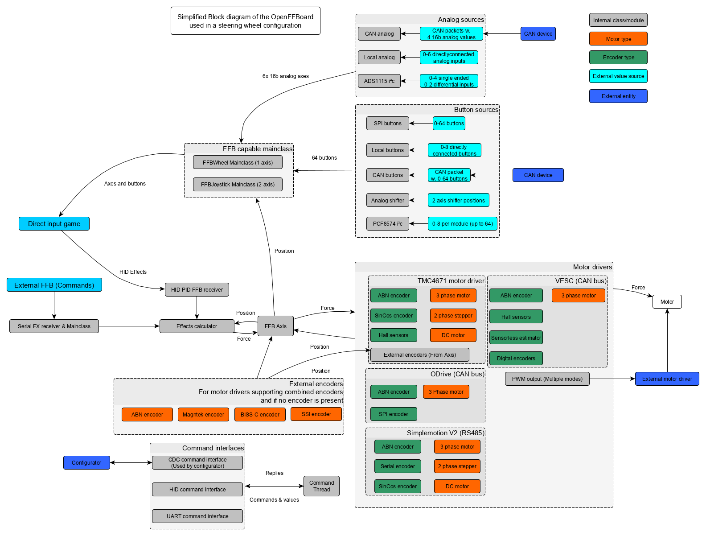

# Open FFBoard Wiki

The _OpenFFBoard_ is an open source firmware (and hardware) project for DIY force feedback devices like sim racing steering wheels ranging from budget DC motor builds up to high end servo direct drive wheels.

Together with a [custom motor driver and usb interface](https://github.com/Ultrawipf/OpenFFBoard-hardware) this project is made for developers and enthusiasts to create their dream setup within a reasonable budget.

The firmware is designed to be easily extendable and to be reconfigured at runtime by the users.

This means the firmware can control different kinds of motors and motor drivers (Stepper, 3 Phase BLDC, DC) motors, read encoder positions and present itself as a force feedback gamepad to the computer via HID.

Having the HID PID implemented in a modular way allows it to be used in different ways without the need to write complex custom USB descriptors.

### Contributing to the Wiki
If you want to create a pull request for the wiki you need to do so on the [OpenFFBoard_wiki](https://github.com/Ultrawipf/OpenFFBoard_wiki) repo which mirrors this wiki because Github does not allow public PR access to the wiki repo directly.

### Block diagram
The following image shows a simplified block diagram of how the OpenFFBoard firmware components would operate in a steering wheel setup and how its software components can be used to interface different peripherals.

