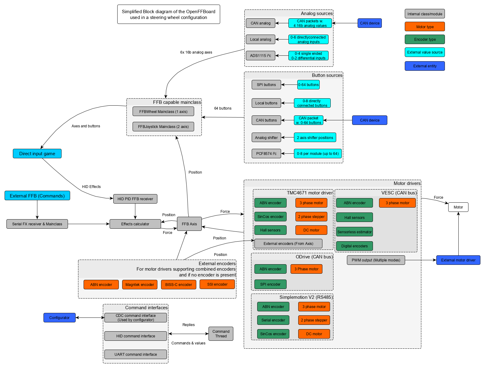

# Open FFBoard Wiki

The _OpenFFBoard_ is an open source firmware (and hardware) project for DIY force feedback devices like sim racing steering wheels ranging from budget DC motor builds up to high end servo direct drive wheels.

Together with a [custom motor driver and usb interface](https://github.com/Ultrawipf/OpenFFBoard-hardware) this project is made for developers and enthusiasts to create their dream setup within a reasonable budget.

The firmware is designed to be easily extendable and to be reconfigured at runtime by the users.

This means the firmware can control different kinds of motors and motor drivers (Stepper, 3 Phase BLDC, DC) motors, read encoder positions and present itself as a force feedback gamepad to the computer via HID.

Having the HID PID implemented in a modular way allows it to be used in different ways without the need to write complex custom USB descriptors.

## Detailed Features

### Main modes:
See [other mainclasses](https://github.com/Ultrawipf/OpenFFBoard/wiki/Commands#other-mainclasses) for full list.
* **FFB Wheel**: 	USB 1 Axis force feedback device with HID FFB support, multiple analog axis inputs (see analog sources) and digital buttons (see digital sources)
* **FFB Joystick**: USB 2 Axis force feedback device

* **EXT FFB Gamepad**: USB 2 axis gamepad device without HID FFB. Use this for simple non FFB devices or send custom FFB data via commands (See [Ext FFB mode](https://github.com/Ultrawipf/OpenFFBoard/wiki/External-FFB-mode))
* **CAN Remote Analog/Digital**: Send all supported digital and analog inputs as CAN packets to a main FFBoard (Receive using CAN Analog/Digital source)
---
* **CAN Interface**: GVRET compatible CAN interface for CAN bus debugging

### Supported motor drivers
|Name|Interface|1ch Wheel support|2ch Joystick support|Supported motors|Supported encoders|Enc forwarding (see [FFBoard supported encoders](#supported-encoders))|Dual interface encoder
|--|--|--|--|--|--|--|--|
**OpenFFBoard TMC4671**|SPI|yes✅|limited⚠️|3 phase servo (BLDC), 2ph stepper (w. encoder), (DC) | ABZ, SinCos, (Digital Hall), Analog hall | yes✅|yes✅
ODrive|CAN|yes✅|yes✅|3 phase servo | ABZ, SPI, Internal (See ODrive docs) | no❌|no❌
VESC|CAN|yes✅|yes✅|3 phase servo| ABZ | no❌|yes✅
PWM|PWM pins|yes✅|no❌|Any external driver (PWM+Dir, Centered, RC PPM, 2x PWM)| Any [FFBoard encoder](#supported-encoders) | no❌|no❌
MyActuator|CAN|yes✅|yes✅|Integrated in servo| Internal | no❌|no❌
Simplemotion|RS432 w. adapter⚠️|yes✅|no❌|3 phase servo, Stepper| ABZ, BISS-C | no❌|no❌

### Supported encoders
Encoders supported directly by FFBoard firmware and main board

Can be forwarded to TMC4671 using external encoder forwarding

|Name|Interface|Absolute|
|-|-|-|
|ABZ Quadrature|ABZ|no❌|
|BISS-C|SPI w. Adapter⚠️|yes✅|
|MagnTek (MT6825,MT6835)|SPI + ABZ|yes✅|
|SSI|SPI|yes✅|

### Contributing to the Wiki
If you want to create a pull request for the wiki you need to do so on the [OpenFFBoard_wiki](https://github.com/Ultrawipf/OpenFFBoard_wiki) repo which mirrors this wiki because Github does not allow public PR access to the wiki repo directly.

### Block diagram
The following image shows a simplified block diagram of how the OpenFFBoard firmware components would operate in a steering wheel setup and how its software components can be used to interface different peripherals.

