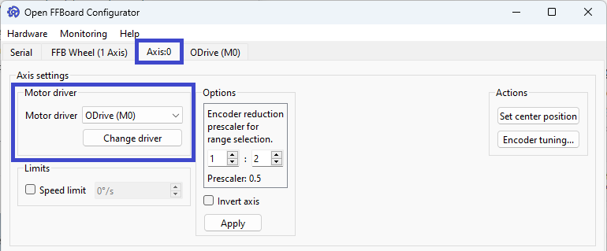

# ODrive Configuration

## Important information

This guide is meant to help you set up an ODrive for use with OpenFFBoard. This is a DIY project and your exact settings are going to depend on the hardware you have. There is no way this guide can give you all the information you need to get it working, so it's important that you ask for help if you need it. 

## Genuine ODrive Setup

If using a genuine ODrive (only available directly from ODrive, not sold on AliExpress or the like), you can follow the instructions in the appropriate ODrive Getting Started guide in their documentation. For ODrive 3.6 and earlier, [use this one](https://docs.odriverobotics.com/v/0.5.6/getting-started.html). For ODrive S1 and ODrive Pro, [use the latest version of the guide](https://docs.odriverobotics.com/v/latest/guides/getting-started.html). In either case, you should follow the instructions to update the firmware to the latest version before proceeding. Please follow the guide from the start and work your way through step by step. If you have trouble configuring your ODrive, the best option for support is the [ODrive Discord server](https://discord.gg/k3ZZ3mS). The ODrive team is active and helpful. Once you have the ODrive able to control your motor, contine to [FFBoard Setup](./ODrive-guide.md#ffboard-setup).


# Clone ODrive Setup

If you have an ODrive clone (found often on AliExpress from Makerbase or Flipsky), it is based on ODrive 3.5 and comes with a very old version of the firmware. You'll need to use [the old version of the guide](https://docs.odriverobotics.com/v/0.5.6/getting-started.html). Please follow the guide from the start and work your way through step by step. If you don't understand what a setting should be, please ask for help. ODrive does not offer support for these devices, so your best bet is probably to ask in the [OpenFFBoard discord server](https://discord.com/servers/openffboard-704355326291607614). This version of the hardware is at end of life and the documentation is broken in some places. If there's something that doesn't make sense, please ask for clarification on Discord.

## ODrive DFU Driver Setup 

**Before getting started, make sure correct drivers are installed for DFU interface. If you have ever installed Thrustmaster force feedback drivers, you will need to uninstall them to be able to update firmware on your ODrive or OpenFFBoard USB interface**

1. **Download Zadig**: [Zadig - USB driver installation made easy](https://zadig.akeo.ie/)
2. Set ODrive to DFU mode. This will vary depending on the board you have. Some have 2 DIP switches, one marked `DFU` and `RUN`, some have jumpers. If you have DIP switches, flip the switch to `DFU`. If you have jumpers, generally you'll need to remove the DFU jumper. If neither of these work, you'll need to find out from the manufacturer how DFU mode works on your device. Common switches and jumpers are pictured below.  

[
[

3. These devices are not powered by the USB port, so you will need to apply power to the board from your power supply to continue. Make sure your polarity is correct as there is no reverse polarity protection. Reverse polarity will damage the board. Please use a [USB isolator](https://odriverobotics.com/shop/usb-isolator) if possible to reduce the chance of damage to your computer.
4. Connect ODrive to PC.
5. Open Zadig


6. In the `Options` menu, select `List All Devices`


7. Find the Device called `STM32 BOOTLOADER`


If the `Driver` box on the left reads `WinUSB` with a version number, you can move to updating the firmware, otherwise proceed to step 7

8. Use the buttons to scroll through the driver options and select WinUSB and click the `Replace Driver` button. This will install the correct driver and can take a while. 

 

 9. Once you see the success dialog box, click close and the Zadig window should look like the image below with the driver matching in both boxes. Close Zadig and continue to installing ODrive firmware

 


## ODrive Firmware


1. Download and install [STM32CubeProgrammer](https://www.st.com/en/development-tools/stm32cubeprog.html). You will need to provide your email address.
2. Download the firmware for your drive. All clones currently on the market are based on ODrive 3.5, but the firmware for 3.6 will work. Make sure to use the correct version for the voltage of your board (24V or 56V). Use the most recent version available. As of this writing, that is 0.5.6 and should be the final release of the firmware for this version of the hardware. The `Getting Started` guide is outdated in this portion and says you need a `.hex` file if you're on Windows. They no longer build `.hex` files, but the `.bin` files work just the same for this process. [Releases · odriverobotics/ODrive](https://github.com/odriverobotics/ODrive/releases)
3. Put the Odrive into DFU mode as described in the DFU driver installation and connect to your computer. 
4. Open the STM32CubeProgrammer and connect to the ODrive. In the following image, you'll see the type of connection is set to `USB` and the port is set to `USB1`. The serial number will be unique for each device. Once you have your device selected, click `Connect`.


5. Your window should now look similar to the following. Click on the 3 lines to expand the menu on the left and select `Erasing & Programming`. 


6. Click `Browse` to find the firmware file you've downloaded and select it. Make sure `Verify programming` and `Full chip erase` are checked and the other boxes are unchecked. Click the `Start Programming` button and wait for the process to complete.


7. Disconnect power, set the ODrive to the `Run` position (the reverse of the procedure to set it to DFU mode), and connect power again.
   

# ODrive Configuration
## Getting started
You should configure your ODrive to be able to control your motor before connecting to the OpenFFBoard USB interface. The [Getting Started](https://docs.odriverobotics.com/v/0.5.6/index.html) guide will step you through this configuration. You should go through the guide step by step and ask questions in discord or refer to the rest of the documentation if you run into issues. This documentation does have issues and is no longer in active development since this hardware is at end of life. Asking questions will help prevent runnig into dead ends with configuration, or possibly even equipment damage.

Any time you're required to save your configuration, it's important to remember the ODrive needs to be in idle. If you call `dev0.save_configuration()` and `odrivetool` returns `False` instead of rebooting the ODrive, you'll need to put it into idle by calling `dev0.axis0.axisstate = IDLE` and then saving the configuration.

## `odrv0` vs `dev0`
As your hardware isn't a genuine ODrive, `odrivetool` will display a warning about that and it will connect as `dev0` instead of `odrv0`. For any commands in the guide, you will need to replace `odrv0` with `dev0`.

## Hoverboard motors
There is a section on setting up hoverboard motors. For our purposes, the only settings information you should use on this page pertains to the motor configuration. The configuration they suggest is as below.

```
dev0.axis0.motor.config.pole_pairs = 15
dev0.axis0.motor.config.resistance_calib_max_voltage = 4
dev0.axis0.motor.config.current_control_bandwidth = 100
dev0.axis0.motor.config.torque_constant = 1
```

If you're using a different type of motor, you'll need to enter values from the datasheet.

## Warnings
1. Do not put the ODrive into closed loop mode without a brake resistor installed. If you purchased one without the brake resistor output, you will need to buy or build a circuit to add to control a brake resistor.
2. Configure and test the motor with nothing attached to the shaft. If something does go wrong, having a steering wheel or adapter mounted to the motor can catch your hands or make it more likely for the motor to move.
3. Clamp the motor down before attempting to enter closed loop control of the motor so it isn't able to move.
4. Avoid connecting USB to both the OpenFFBoard and ODrive at the same time. This can possibly create a ground loop and cause damage.

## Configuration required to connect to OpenFFBoard     
You'll need to configure CAN on the ODrive to communicate with the OpenFFBoard USB interface. This is handled with the following commands:    
    
```
dev0.axis0.config.can.node_id = 0 
dev0.can.config.baud_rate = 500000
```
The first sets the CAN node ID and the second sets the CAN baud rate. You can change these, but they will need to match your settings in the OpenFFBoard configurator. The above are the recommended settings.

You will also want to make sure to set the ODrive to torque control mode. In the past, OpenFFBoard reliably did this automatically, but no longer does. The getting started guide includes testing the motor in position control mode. If the ODrive is in position control mode while receiving torque commands from OpenFFBoard, it will still change the torque command, but the motor will try to hold position instead of force feedback by torque as designed.

`odrv0.axis0.controller.config.control_mode = CONTROL_MODE_TORQUE_CONTROL`

ODrive is set by default to limit velocity in torque control mode, which will greatly reduce the torque commanded, even at 0 RPM. To disable this, enter

`dev0.axis0.controller.config.enable_torque_mode_vel_limit = False`

# Configuring for automatic startup

Once you're able to control your motor with the ODrive, you'll want to configure it to be able to enter closed loop control directly at startup. This is not enabled by default and you would be required to connect to the ODrive and do a full calibration sequence before being able to enter closed loop control. [This section](https://docs.odriverobotics.com/v/0.5.6/encoders.html#encoder-with-index-signal) of ODrive's documentation covers this process. 

If you have an incremental encoder without an index pulse (or if you're using a gear reduction on your encoder), you won't be able to use the index. In that case, you'll need to take some extra steps.

1. Perform a motor calibration with `dev0.axis0.requested_state = AXIS_STATE_MOTOR_CALIBRATION`
2. Save the motor calibration with `dev0.axis0.motor.config.pre_calibrated = True`
3. Enable a startup encoder offset with `dev0.axis0.config.startup_encoder_offset_calibration = True`
4. Save the configuration with `dev0.save_configuration()`

 # FFBoard Setup

1. Download and the Open FFBoard Configurator from [OpenFFBoard releases](https://github.com/Ultrawipf/OpenFFBoard/releases). Unzip the archive and start `OpenFFBoard.exe`.
2. Select the FFBoard and click `Connect`.
3. In the `Axis:0` tab, change `Motor driver` to `ODrive` and click `Change driver`.


4. In the `ODrive` tab that appeared, click on `Change CAN Settings` and set the baud rate to the same as the one you configured on the ODrive. Click Ok.


5. Set `Max torque range` to your motor specs and Axis CAN ID to the node ID you set on the ODrive and click `Submit`. If successfully configured, the `Voltage`, `Axis state`, and `Errors` boxes should populate with information when you connect and power on the ODrive.


6. Click `Save to Flash` at the bottom right corner on any tab.


## Wiring CAN
To properly wire CAN, you will need to connect 3 wires between the two boards. ODrive reccomends having a ground wire connected between the two boards along with the `CAN H` and `CAN L` wires. Both the ODrive and USB interface should have CAN termination resistors on them, but you will need to refer to the documentation for your hardware to determine how to enable them as it varies depending on version.

It's recommended to use twisted pair and/or shielded wire for this connection, but your results may vary. `CAN H`on one board is connected to `CAN H` on the other and `CAN L` on one to `CAN L` on the other. 