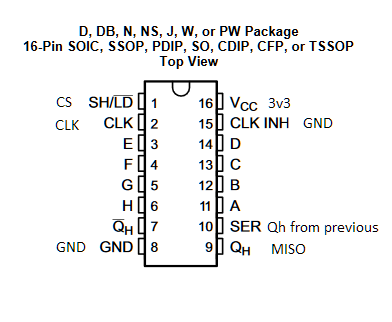
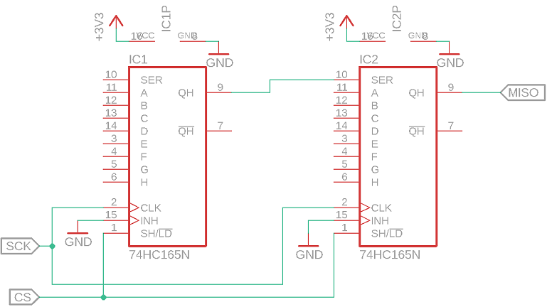
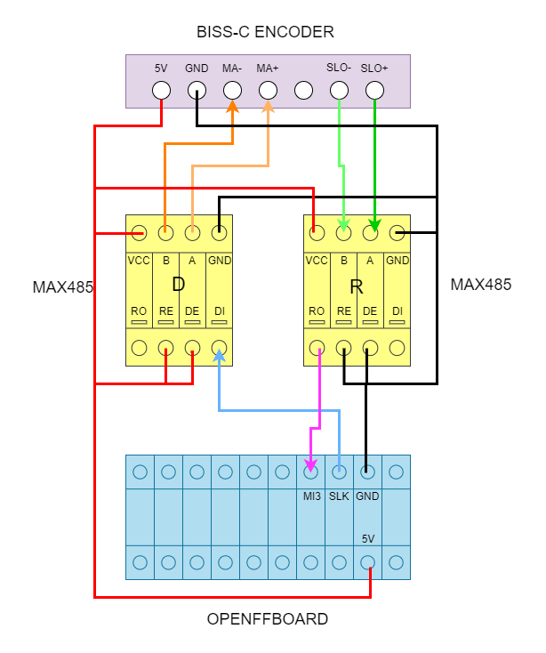
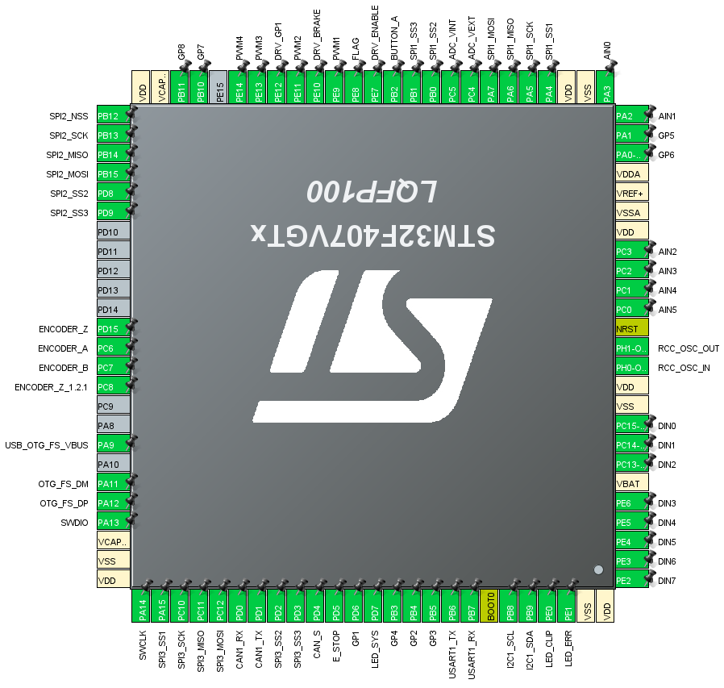
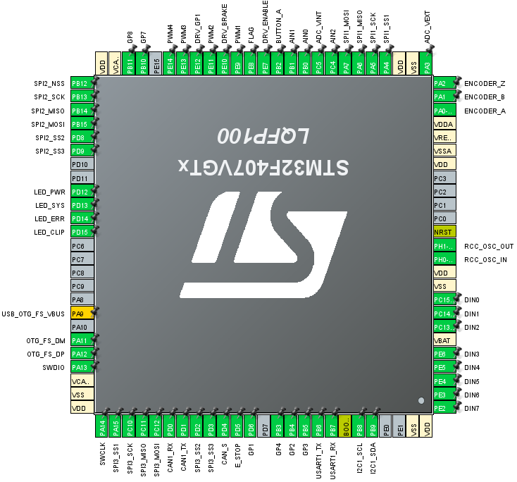
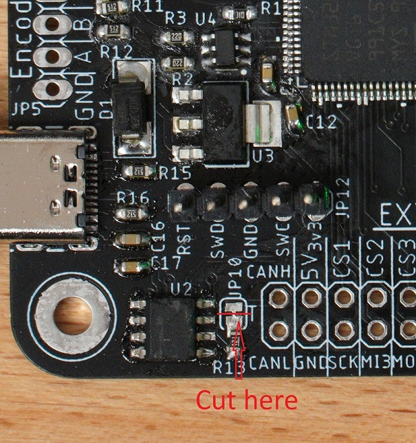
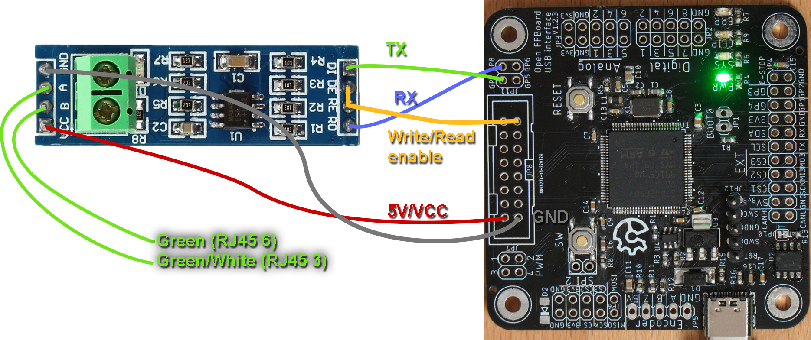

## F407 FFBoard

### Digital buttons

Up to 8 gamepad buttons are mapped if all 8 pins are enabled.
|FFBoard pin|STM pin|
|--|--|
|D0 (1) | PC15|
|D1 (2) | PC14|
|D2 (3)| PC13|
|D3 (4)| PE6|
|D4 (5)| PE5|
|D5 (6)| PE4|
|D6 (7)| PE3|
|D7 (8)| PE2|

### Analog inputs

Up to 6 analog pins are mapped to gamepad axes with 12 bit ADC resolution.

|FFBoard pin|STM pin|
|--|--|
|A0 (1)| PA3|
|A1 (2)| PA2|
|A2 (3)| PC3|
|A3 (4)| PC2|
|A4 (5)| PC1|
|A5 (6)| PC0|

### Analog shifter

An analog shifter is a 2 axis joystick with positions mapped to gamepad buttons.

Use 3.3V for the shifter supply! NOT 5V! 5V can damage the chip and will result in incorrect values.

**G29 mode:**

X and Y channels can be mapped to analog inputs. Default is input 5 and 6 (A4 & A5).

The reverse button (Reverse gear if position is gear 6 & reverse button pressed) is mapped to a digital input. Default is input 1.

**G27 mode:**

X and Y channels are the same as in G29 mode but it also has additional SPI buttons with the reverse button being one of them. The CS pin of SPI2 has to be specified. Connections are the same as with the SPI button source.

### SPI2
|FFBoard pin|STM pin|
|--|--|
|SPI2 SCK| PB13|
|SPI2 MOSI| PB15|
|SPI2 MISO| PB14|
|SPI2 CS1 (main)| PB12|
|SPI2 CS2| PD8|
|SPI2 CS3| PD8|

#### SPI buttons

* CS polarity LOW in 74HC165 mode
* CS polarity HIGH in HEF4021BT (Thrustmaster) mode
* Clock polarity low

* CS - latch
* MISO - Data from last shift register in chain
* CLK - CLK
* MOSI - unused

Unused bits will be cut from the MSB in 74HC165 mode but from the LSB in Thrustmaster mode. (TM uses these for identification)

##### 74HC165 PISO shift register connections

If more than one shift register is used connect Qh (serial output) to SER (serial input) of the next one and Qh of the last one to MISO

#### I2C PCF8574
* SDA - SDA
* SCL - SCL
* VCC - 3.3V
* GND - GND

Use first address (A0,A1,A2 = LOW) for first PCF in chain, second address for second one (if >8 buttons) and so on.

### PWM mode

PWM pins are on TIM1
|FFBoard pin|STM pin|
|--|--|
|PWM1| PE9|
|PWM2| PE11|
|PWM3| PE13|
|PWM4| PE14|

**RC PPM:**
* PWM1: 1000-2000µs with 0 at 1500µs

**Centered PWM:**
* PWM1: PWM with 0 torque at 50%, -100% at 0% and 100% at 100% pwm

**Dual PWM:**
* 0-100% on PWM1 if torque positive, PWM2 0%
* 0-100% on PWM2 if torque negative, PWM1 0%

**PWM/DIR:**
* PWM1: PWM output
* PWM3 (PWM2 for disco): Direction (left, inverted to PWM4)
* PWM4: Direction (right)

### MT6825 encoder
Use SPI3 on EXT header

### BISS-C on SPI3
2 MAX485 transceiver modules are required. One for modulating the clock signal and one for receiving the encoder data.
Connect this to SPI3 on the EXT header according to the following picture.

A step by step guide is available in this [video](https://youtu.be/GBKCCanImxA?t=1095).
Note: in the graphics used in the video the A connection goes to the negative rs485 lines. It should go to the positive instead.

The encoder data can be forwarded to the TMC. Select the external encoder in the TMC encoder selection for that and select the corresponding BISS-C encoder in the axis encoder selection then.

### F407 official CubeMX pinout

### F407 DISCO pinout

Discovery board connections are based on mmos/osw pinouts but not completely identical.
The PWM DIR pin is changed to PWM 2 (PE11) for mmos compatibility.
A CAN transceiver (TJA1051/3) could be connected for vesc and odrive support.

### Brake resistor
The brake resistor and voltage sense circuit is intended for the TMC4671 but is currently always active and will work with other drivers as well.
You need to connect a 10k/294k voltage divider to the vint (internal motor voltage after diode) and vext (to power supply before diode) pins and it will activate when the internal voltage is 5V above the external voltage.

### CAN bus
The CAN bus is designed to use a TJA1501/3 transceiver with the silent pin connected to PD4.

On the official board this is included as well as a 120 ohm termination which can be disconnected or connected using a solder jumper. By default it is connected on most boards with a cuttable trace that can be reconnected if required.
Most CAN devices require this resistor to stay connected but certain devices like a BMW E90 instrument cluster i tested will only work reliably with it disconnected.

The following image shows how to disconnect the termination on the V1.2.3 board:

On the V1.2.4 the solderjumper was replaced with a normal pinheader jumper.

### Granite simplemotion
Connect the following pins of the official OpenFFBoard to a RS485 transceiver (MAX585 breakout board for example)
|FFBoard pin|MAX485 pin|
|--|--|
|GP7 (TX)| DI|
|GP8 (RX)| RO|
|DRV_GP| RE & DE|
|5V| VCC|
|GND| GND|

Also connect GND to the RJ45 cable to the driver.

