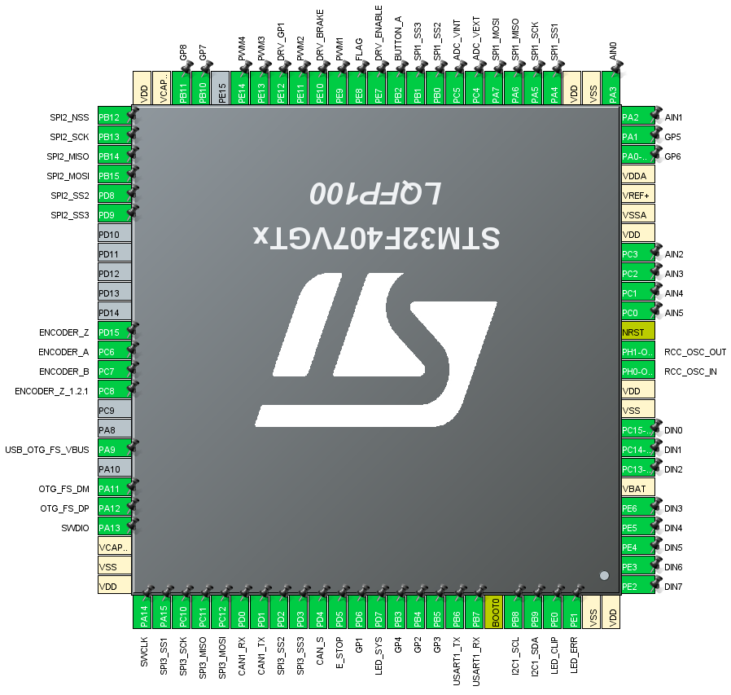

## F407 FFBoard

### Digital buttons

Up to 8 gamepad buttons are mapped if all 8 pins are enabled.
|FFBoard pin|STM pin|
|--|--|
|D0 (1) | PC15|
|D1 (2) | PC14|
|D2 (3)| PC13|
|D3 (4)| PE6|
|D4 (5)| PE5|
|D5 (6)| PE4|
|D6 (7)| PE3|
|D7 (8)| PE2|

### Analog inputs

Up to 6 analog pins are mapped to gamepad axes with 12 bit ADC resolution.

|FFBoard pin|STM pin|
|--|--|
|A0 (1)| PA3|
|A1 (2)| PA2|
|A2 (3)| PC3|
|A3 (4)| PC2|
|A4 (5)| PC1|
|A5 (6)| PC0|

### Analog shifter

An analog shifter is a 2 axis joystick with positions mapped to gamepad buttons.

**G29 mode:**

X and Y channels can be mapped to analog inputs. Default is input 5 and 6 (A4 & A5).

The reverse button (Reverse gear if position is gear 6 & reverse button pressed) is mapped to a digital input. Default is input 1.

**G27 mode:**

X and Y channels are the same as in G29 mode but it also has additional SPI buttons with the reverse button being one of them. The CS pin of SPI2 has to be specified. Connections are the same as with the SPI button source.

### SPI2
|FFBoard pin|STM pin|
|--|--|
|SPI2 SCK| PB13|
|SPI2 MOSI| PB15|
|SPI2 MISO| PB14|
|SPI2 CS1 (main)| PB12|
|SPI2 CS2| PD8|
|SPI2 CS3| PD8|

#### SPI buttons

* CS polarity LOW in 74HC165 mode
* CS polarity HIGH in HEF4021BT (Thrustmaster) mode
* Clock polarity low

* CS - latch
* MISO - Data
* CLK - CLK
* MOSI - unused

Unused bits will be cut from the MSB in 74HC165 mode but from the LSB in Thrustmaster mode. (TM uses these for identification)

### PWM mode

PWM pins are on TIM1
|FFBoard pin|STM pin|
|--|--|
|PWM1| PE9|
|PWM2| PE11|
|PWM3| PE13|
|PWM4| PE14|

**RC PPM:**
* PWM1: 1000-2000µs with 0 at 1500µs

**Centered PWM:**
* PWM1: PWM with 0 torque at 50%, -100% at 0% and 100% at 100% pwm

**Dual PWM:**
* 0-100% on PWM1 if torque positive, PWM2 0%
* 0-100% on PWM2 if torque negative, PWM1 0%

**PWM/DIR:**
* PWM1: PWM output
* PWM3: Direction (left, inverted to PWM4)
* PWM4: Direction (right)

### MT6825 encoder
Use SPI3 on EXT header

