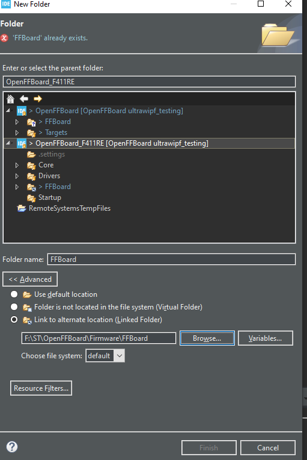
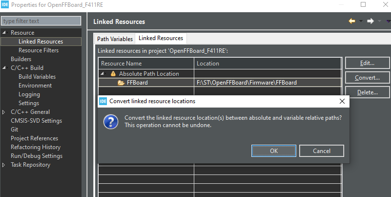
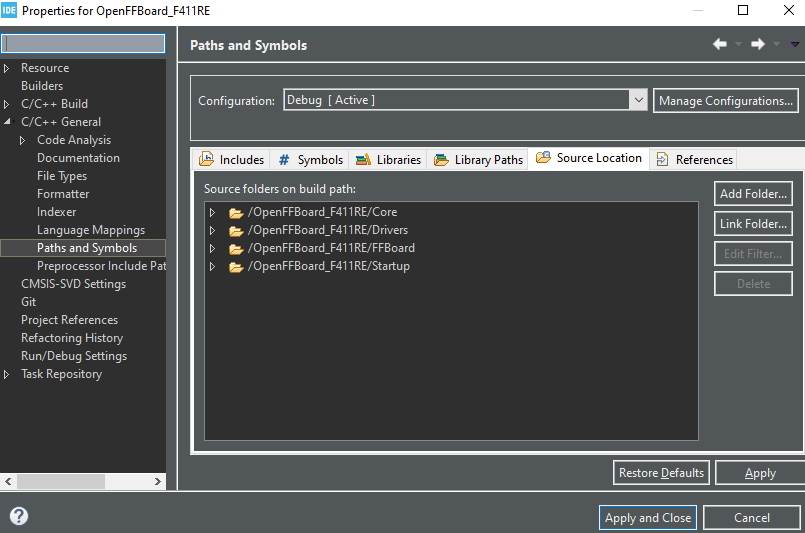
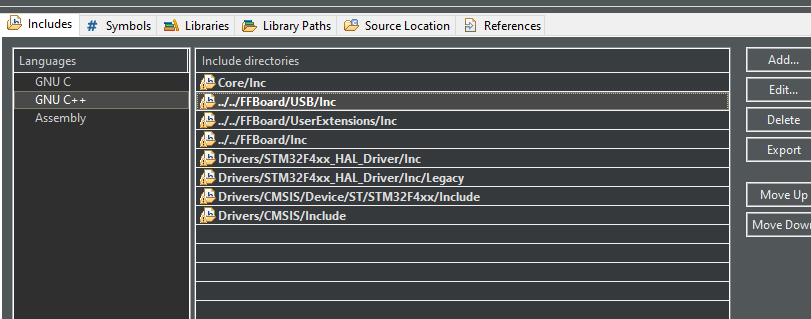

## Project structure

The project is split into the base FFBoard code and in a `Target` subfolder are different target projects for different hardware.
These subprojects have to reference folders in the parent project.

To link a source folder choose "new/folder" and "advanced" and select the FFBoard source folder you want to link into the subproject.
Then you can select the linked folder as a source location.

For the headers use a relative path with `../../../` prefix.

 

  Convert path to relative

  

  Add as source
 
  

  Add header paths as relative

 

### Buildsettings:
* enable float for printf
* disable -fno-rtti

Some constants and defines to be set in the target headers
