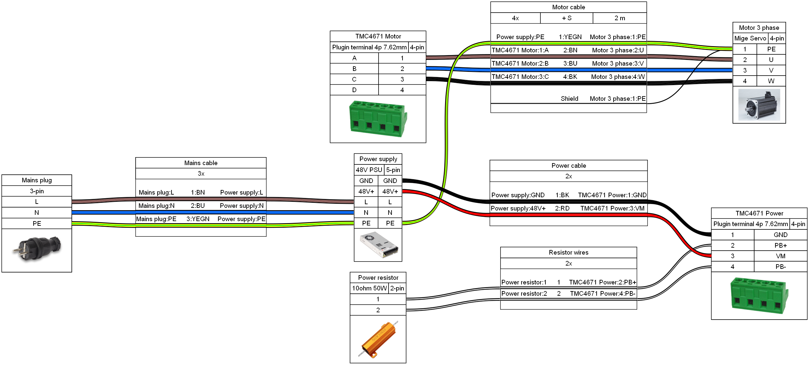

## Setup description

### General firmware installation/update procedure

#### DFU driver installation
Note: this step is not required when STM32CubeProgrammer is installed. It automatically includes the driver when installed.

Use [Zadig](http://zadig.akeo.ie/) to manually install a winusb driver for the DFU device (must be in DFU mode. Short boot0 jumper and reset or use configurator to enter)

Warning: Do **NOT** accidentially overwrite the driver for any other device. It will stop working until you manually uninstall the driver again with the device manager!

#### DFU with Configurator

If a firmware is already present connect as usual with the serial port and then open the DFU menu (DFU button or Hardware->Firmware Update).
Enter the DFU mode and it should be detected.

Select the .hex file for your chip (F407 for official OpenFFBoard) and upload it. Wait until it is completed (takes 30s-1m) and then reset the device if it does not automatically restart.

#### DFU or STLink with STM32CubeProgrammer

[STM32CubeProgrammer](https://www.st.com/en/development-tools/stm32cubeprog.html) can be used to flash .hex files either via DFU (short boot0 jumper/connect boot0 to 3.3v) or with the STLink programmer (SWD debug header).

If the device is detected load the .hex file and upload it.

#### Boot0 jumper and debug header position

#### Settings
Due to common mistakes about understanding power and effect ratio:

Power is the total maximum force sent to the motor driver (16b). This is important for motor drivers where the output force directly controls the motor current (PWM, TMC...)

Effect scaler prescales the game effects down to leave extra force for the endstop so you can still feel it without already being clipped by the game.

Formula:

`effect_torque = all_effects_added * effect scale (0-100%)`

`total_output  = effect_torque + endstop_torque * (power/0x7fff)`

### Wheel setup with TMC4671

The OpenFFBoard STM board must be stacked on top of the TMC4671 driver board to ensure short connections and good grounding.
Use conductive standoffs on the connector side and if you experience instability with driver versions up to v1.2.2 it is recommended to use non conductive nylon standoffs for the inner 2 screws close to the mosfets to reduce noise coupling through the groundplane.

Power connection diagram:

Setup steps:
- Short the SPI CS1 address pad on the underside of the TMC4671 board and add the 5V jumper next to the interconnect if not done
- Stack the STM and TMC boards
- Connect motor to motor output terminal and encoder to ENC header (for ABN encoders) or SinCos encoder to AENC header on the TMC (set 2.5V offset jumpers if single ended, remove jumpers if differential). Do **NOT** use the enc header on the STM board.
- **Connect 10 ohm 50W brake resistor to PB+ and PB- pins on power terminal**
- Connect via USB (Do not power up the motor power supply yet). If 5V jumper is set the TMC will power up too (check LED)
- Select FFBWheel mode as the mainclass and wait to reboot
- Select TMC4671 CS1 as the motor driver
- The TMC tab should show a connection and updating current sensors (may be slightly off. calibration comes later)
- Select the right TMC driver board and current sensor type (Used for internal constants and current scaling)
- Select the right motor type and pole pairs (Example Mige 130ST M10010: 3 phase BLDC, 4 pole pairs)
- Select encoder type (Example ABN encoder, 40000 CPR for 10kppr encoders. CPR = 4x ppr)
- Submit encoder and motor selections, make sure its correct
- **Save to flash!**
- Restart the board and check if settings are still correct (If it didn't save go to troubleshooting below)
- Connect power supply to TMC (10-50V). Careful on first startup. Check if the voltages are read correctly. If there is any connection issue resulting in wrong voltage readouts the brake resistor may wrongfully activate for prolonged times (**FIRE HAZARD**)
- If everything is set up right the motor will move a bit and try to calibrate the encoder. This takes about 5 seconds.
- Do the initial calibration (Button in GUI. Or "calibrate" command). This will ramp up the current and measure the ADC offsets, move the motor to check the encoder direction and polarities and calibrate constants that can be saved in flash to speed up the next startups. This has to be done whenever the TMC4671 driver is changed.
- Save new settings to flash
- Restart and check if it works

### Troubleshooting
#### My settings don't get saved (reverts to basic mode)
This is rarely occuring on fresh F407 chips and seems to be a flash issue. Do a full chip erase using the STM32CubeProgrammer or the DFU updater window and reflash the firmware fresh. This usually fixes it

#### Can't find the serial port
You may need to manually load a usbserial driver for the device. Check the device manager if it shows up and use the driver inf file to install the driver (or manually select usbser).
On windows 10 and above, linux and mac the driver should be loaded automatically.

#### TMC says ADC calibration failed
This is likely a soldering issue or hardware defect (if using the ADS shunt amps).
You can check the raw adc data with `tmc.0.reg=0?3;tmc.0.reg?2` in debug mode (`sys.debug=1`).
It will reply an integer containing 2 16b values.
u16(15:0) = ADC_I0_RAW, u16(31:16) = ADC_I1_RAW.
Convert to hex and both should be close to 0x7fff.
If one value is stuck high there is a broken. I0 is phase A, I1 phase C.

### ODrive setup

#### Quick overview

Read ODrive [getting started page](https://docs.odriverobotics.com/v/latest/getting-started.html)

Warning: ODrive will refuse to run motors with over 4µH inductance!

Connect CANH and CANL between ODrive and FFBoard

Example commands for S1 (ODrive 3.6 may differ. Change axis.config.motor to axis.motor.config)

* CAN speed: `odrv0.can.config.baud_rate=500000` (or 1000000)
* Current limit: `odrv0.config.dc_max_positive_current=10` and `odrv0.axis0.config.motor.current_soft_max=8` and `odrv0.axis0.config.motor.current_hard_max=10`
* Calibration current: `odrv0.axis0.config.calibration_lockin.current=3` and `odrv0.axis0.config.motor.calibration_current = 4` (Lower than current limit)
* Resistor: `odrv0.config.brake_resistor0.resistance=2` (2 ohm default) and `odrv0.config.brake_resistor0.enable=True`

Example for ABN encoder:
For S1:
* Encoder mode (ABN): `odrv0.axis0.config.load_encoder=EncoderId.INC_ENCODER0` and `odrv0.axis0.config.commutation_encoder=EncoderId.INC_ENCODER0` ([Encoder definition](https://docs.odriverobotics.com/v/latest/fibre_types/com_odriverobotics_ODrive.html#ODrive.EncoderId))
* Encoder CPR: `odrv0.inc_encoder0.config.cpr = 8192`
+ `odrv0.inc_encoder0.config.enabled = True`

For 3.6:
* CPR `axis0.encoder.config.cpr`

Motor:
* Motor type: `odrv0.axis0.config.motor.motor_type=0` ()
* Pole pairs: `odrv0.axis0.config.motor.pole_pairs=xxx` (Often 4 or 5)
* Torque constant: `odrv0.axis0.config.motor.torque_constant=1` (Adjust for your motor)
* Calibration voltage: `odrv0.axis0.config.motor.resistance_calib_max_voltage=15` (Less than half PSU voltage. Increase if you get PHASE_RESISTANCE_OUT_OF_RANGE error)
* Optional startup calibration: `odrv0.axis0.config.startup_motor_calibration=True`
* Optional encoder calibration: `odrv0.axis0.config.startup_encoder_offset_calibration=True`
* Save: `odrv0.save_configuration()`

* Disable velocity limit and error: `odrv0.axis0.controller.config.enable_vel_limit=False` `odrv0.axis0.controller.config.enable_overspeed_error=False`