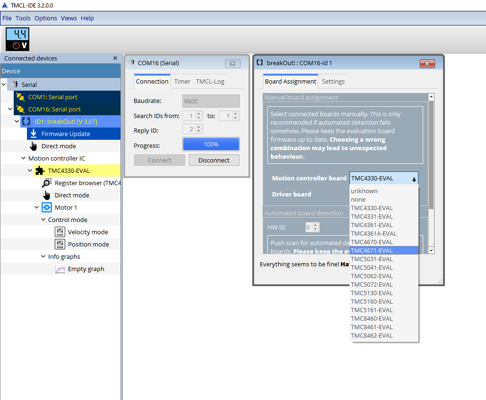
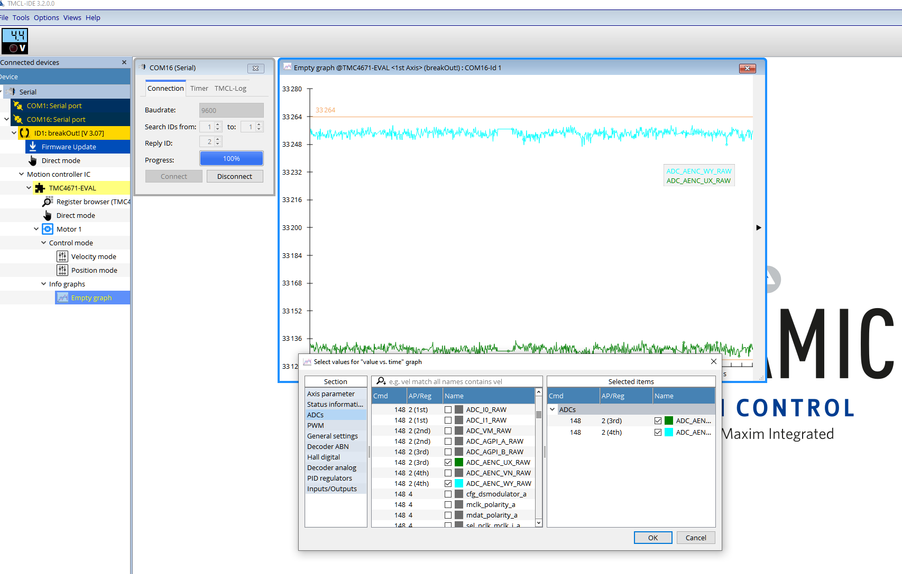

## Debugging a TMC4671 board with the TMCL-IDE
Debugging with the TMCL-IDE does not require any debug probes. You can use the FFBoard as the interface.

### Setup
- Enable FFBoard debug mode and select TMC debug bridge mainclass. (`sys.debug=1;`) and (`sys.main=11;` or disconnect and select mainclass in UI)
- Start TMCL-IDE and connect serial port (make sure FFBoard GUI is disconnected)
- Select TMC4671 in the type selection (see image)

### Checking ADC signals
- Open a new graph, right click and select value sources
- Select RAW ADC values (Current sensors I0,I1 or AENC)

### Other functions
You can also read and write registers with the register browser. **Be careful changing settings when powered up! Hardware damage may occur.**